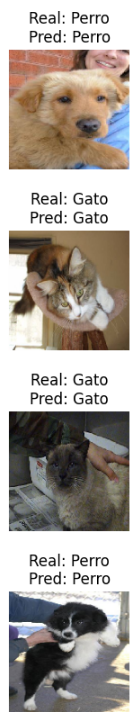

# 🐶🐱 Dog vs Cat Image Classifier

This project showcases a deep learning approach to binary image classification using convolutional neural networks (CNNs). The model is trained to distinguish between images of cats and dogs using TensorFlow and Keras.

<p align="center">
  
</p>

---

## 🧠 Tech Stack

- Python
- TensorFlow & Keras
- NumPy, Matplotlib
- Jupyter Notebook

---

## 📂 Dataset

This project uses a **custom dataset** consisting of:

- 🐶 **2,000 images of dogs**
- 🐱 **2,000 images of cats**

These images were collected and curated manually for academic purposes. The dataset is **not sourced from Kaggle or any other public dataset provider**.

The dataset is  included in this repository.  
To run the project, be sure to have the images inside the `data/` directory.

---

## 🚀 Features

- Image preprocessing using `ImageDataGenerator`
- Transfer Learning with a pre-trained model
- Fine-tuning of upper layers
- Model evaluation and visualization
- Saves best model using `ModelCheckpoint`

---

## 🛠️ How to Run

```bash
pip install -r requirements.txt
jupyter notebook dog_vs_cat_cnn.ipynb
